# spa富应用开发

## 课程说明

##### 1、跨端开发

- 跨不同的硬件端（pc，mobile，pad）

- 跨不同的平台端（软件端，操作系统）（IE，Firefox，Google）

##### 2、web app

- 按硬件分
  1. 桌面应用
  2. 移动端应用
- 按开发方式分
  1. 本地应用
  2. Web 应用
  3. 混合应用

##### 3、SPA

Single Page Application

##### 4、RIA（富应用）

Rich Internet Application

富应用的三个标志：

- web应用程序虽然在浏览器里访问，但**响应速度很快**，可以与本地应用程序相媲美，比如大型动作游戏

- 可以处理多媒体，文字、图片、音频、视频...

- 前端不仅有界面，也有业务逻辑、数据存储

##### 5、web技术发展概述

1993 —— 浏览器出现表单，可提交数据

1995 —— 创建JavaScript语言

1996 —— flash诞生

...

（vim中i ctrl + y , 生成html框架）

##### 6、lrd

lrd —— live reload —— browser -sync

**最多只能访问lrd根目录的文件，就算index里引用也引用不到**

##### 7、单页与多页

**单页文件**：只有一个html文件，**局部刷新**，用户体验好

**多页**：多个HTML文件，会页面跳转，**浏览器会整页刷新**，会造成0.几秒的空白

不严格的说，只要前后端分离，就是spa

浮点舍入误差：0.3 * 0.2

##### 8、css选择器语法的作用

- emmet插件，快速生成html dom语法
- crawler -> page -> get data
- ui自动化测试，定位要操作的元素
- 本身用途，html dom设置样式


## 自动化构建

### 一、自动化构建基础

##### 1、脚手架

临时辅助软件构建，不是软件一部分，示例.c文件和.h文件构建成.exe文件，脚手架辅助构建

##### 2、框架

框架代码，是软件的一部分，完成程序的功能

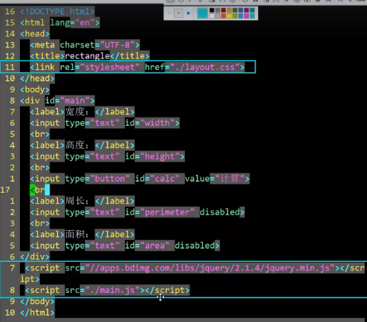

##### 3、自动化构建（build automation）

构建（build）：完成一个加工，有**输入**（**源代码**，不可执行的文本文件）有**输出**（**可执行的代码**，通常为二进制文件） 

自动化构建输入的程序的代码，输出的是程序的软件

自动化构建需要编写自动化构建脚本，告诉计算机该怎么构建

编译成obj文件——连接，将obj文件和库文件连接起来

构建——自动化构建，自动化测试，持续集成，自动发布，持续提交

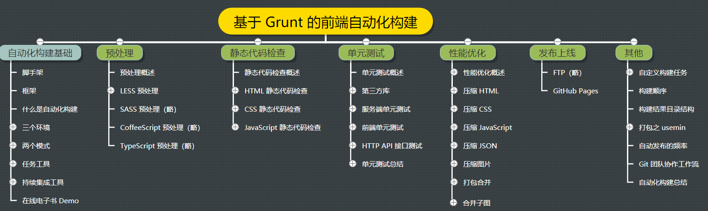

两种压缩

-  a.js->a.rar 
- a.js->a.min.js（去掉注释，去掉空行，去掉空格）

后端代码不需要做前端代码的这种性能优化，后端只需做静态代码检查和单元测试，但都是js代码

- 后端代码：nodejs -> back-end.js（不需要做压缩的性能优化）在服务器上运行，不需要传输下载，所以不用压缩

- 前端代码：前端 -> front-js.js（需要压缩优化）在浏览器里下载，解释执行


压缩不是为了减少占用磁盘空间，而是怕浪费带宽

##### 4、两个模式

- **调试模式** Debug

   程序员接触时间更长

   牺牲性能

- **发布模式** Release

   跟用户打交道

   牺牲调试

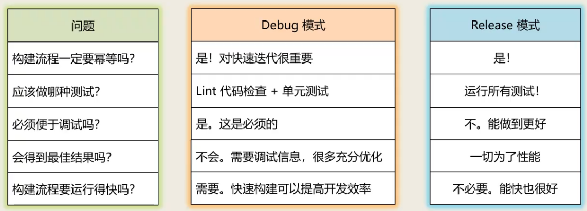

##### 5、三个环境

- **开发环境** development

   硬件与生产环境不同（个人电脑），软件可能相同（linux系统）

   只有各个开发者能访问

- **测试环境** staging

   开发者和产品开发人员能通过互联网访问

- **生产环境** production

   最终用户可以公开访问

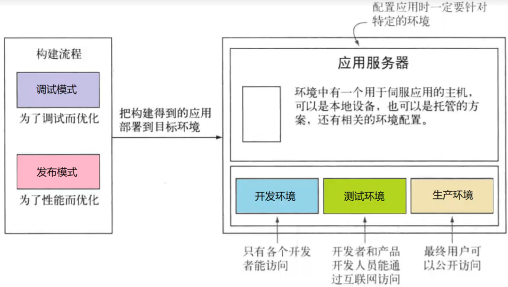

npm i -S cheerio 项目依赖 —— dependencies里边显示cheerio，发布模式依赖的

npm i -D mocha 开发依赖 —— devDependencies里边显示mocha，调试模式依赖的

npm i 都会装上，开发环境，测试环境

npm i production —— 只安装dependencies里边的，生产环境不需要devDependencies里边的

理念：构建优先 -> 自动化构建

在写代码之前，先搭脚手架，编写自动化构建代码

静态代码检查：检查语法错误，检查代码风格

##### 6、自动化构架流程

1. 将代码推送到代码仓库

2. 代码仓库的钩子，当接收到代码改变，将触发持续集成服务

##### 7、自动化构建的触发或自动化构建的频率

1. 当仓库有新的提交的内容，通过钩子触发

2. 每日构建，定时器触发

##### 8、工具栈：三类工具

1. **版本控制系统**（客户端，服务器端）

   分布式（**git**）、集中式（svn）

2. **构建任务工具**

   不同的语言不一样

   **grunt**（构建任务是串行执行的，构建任务是通过插件（官方、个人，质量参差不齐）完成的）

   gulp.js（通过流，进行并行执行）

   webpack（不是构建任务工具，是一个打包工具，十个js文件合并成一个js文件，也能完成响应的任务）

3. **持续集成工具**

   **Travis CI**、Jenkins

##### 9、构建gitbook

###### （1）手动构建

1. 在`GitHub`中创建`gitbook`仓库

2. 在本地仓库中编写文件

   ```bash
   ~/GitBook(master) » vim ch01.md ch02.md SUMMARY.md
   
   ~/GitBook(master) » cat SUMMARY.md                               
   - [简介](README.md)
   - [第一章](ch01.md)
   - [第二章](ch02.md)
   - [第三章](ch03.md)
   
   ~/GitBook(master) » npm i -g gitbook-cli # 安装gitbook脚手架
   
   ~/GitBook(master) » gitbook build # 创建gitbook 会生成_book目录 在_book目录下lrd能访问电子书
   ```

3. 利用分支生成`GitHub Pages`

   ```bash
   ~/GitBook(master) » gitbook build
   ~/GitBook(master) » mv _book/* ~/tmp
   ~/GitBook(master) » git checkout -b gh-pages
   ~/GitBook(gh-pages) » rm *
   ~/GitBook(gh-pages) » mv ~/tmp/_book/* .
   ~/GitBook(gh-pages) » git add -A
   ~/GitBook(gh-pages) » git commit -m "book v0.1 publish"
   ~/GitBook(gh-pages) » git push --set-upstream origin gh-pages
   ```

###### （2）自动构建

1. 在`master`分支下编写`.travis.yml`

   ```yml
   language: node_js
   node_js:
       - "node"
   
   after_script:
     - gitbook build
     - cd ./_book
     - git init
     - git config user.name "${USER_NAME}"
     - git config user.email "${USER_EMAIL}"
     - git add .
     - git commit -m "publish gitbook"
     - git push --force --quiet "https://${ACC_TOKEN}@${GH_REF}" master:${BRANCH}
   
   branches:
     only:
       - master
   ```

2. 在`master`分支下编写`package.json`

   ```json
   {
     "name": "gitbook",
     "version": "1.0.0",
     "description": "在线电子书",
     "main": "index.js",
     "scripts": {
       "test": "echo \"Error: no test specified\" && exit 0"
     },
     "repository": {
       "type": "git",
       "url": "git+https://github.com/fuziwang/GitBook.git"
     },
     "author": "fuziwang",
     "license": "MIT",
     "bugs": {
       "url": "https://github.com/fuziwang/GitBook/issues"
     },
     "homepage": "https://github.com/fuziwang/GitBook#readme",
     "devDependencies": {
       "gitbook-cli": "^2.3.2"             
     }
   }
   ```

3. `travisCI` 持续集成 `gh-page` 并部署`ACC_TOKEN`、`BRANCH`、`GH_REF`、`USER_EMAIL`、`USER_NAME`

   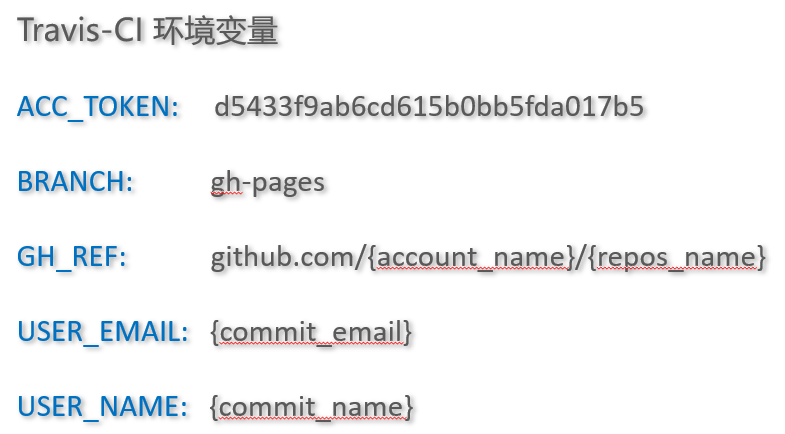

   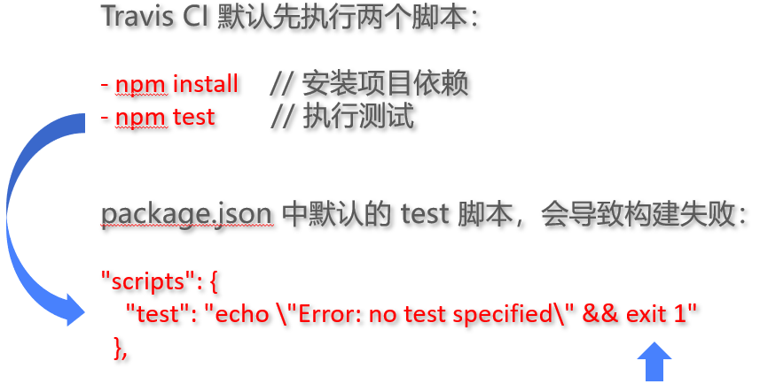

   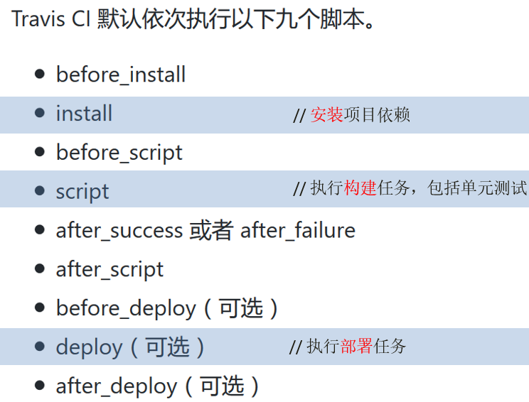

4. 部署成功后访问`GitHub Pages`

   ```bash
   ~/GitBook(master) » vim ch03.md SUMMARY.md
   ~/GitBook(master) » git add -A
   ~/GitBook(master) » git commit -m "book v0.2"
   ~/GitBook(master) » git push
   ```

### 二、静态代码检查

##### 1、为何要用构建工具？

一句话：自动化。对于需要反复重复的任务，例如压缩（`minification`）、编译、单元测试、`linting`等，自动化工具可以减轻你的劳动，简化你的工作。当你在`Gruntfile.js`文件正确配置好了任务，任务运行器就会自动帮你或你的小组完成大部分无聊的工作。

##### 2、为什么要使用 Grunt？

Grunt 生态系统非常庞大，并且一直在增长。由于拥有数量庞大的插件可供选择，因此，你可以利用 Grunt 自动完成任何事，并且花费最少的代价。

##### 3、grunt plugin

grunt plugin（插件） ：构建任务  —— 1 : 1

plugin本质就是一个node.js模块，发布到npmjs.com

- 官方插件：grunt-contrib-xxx
- 非官方插件：grunt-xxx

全局：npm i -g grunt-cli

本地：npm i -D grunt-cli

##### 4、html静态代码检查

规则：vim插件、命令行工具、grunt插件、配置文件

```bash
# 1. 复制文件并且添加编写.htmlhintrc文件
~/grunt-demo(htmlhint) » cat .htmlhintrc
{
  "tagname-lowercase": true, # 小写的标签
  "attr-lowercase": true,
  "attr-value-double-quotes": true,
  "attr-value-not-empty": false,
  (省略...)
}

# 2. 安装grunt和grunt-htmlhint插件
~/grunt-demo(htmlhint*) » npm i -D grunt grunt-htmlhint

# 3. 编写Gruntfile.js文件
~/grunt-demo(htmlhint*) » cat Gruntfile.js

module.exports = function(grunt){
  grunt.initConfig({
    htmlhint:{
      html:{
        options:{
          htmlhintrc:'.htmlhintrc'
        },
        src:['*.html']
      }
    }
  });

  grunt.loadNpmTasks('grunt-htmlhint');

  grunt.registerTask('default',['htmlhint']);
};

# 4. 执行自动化构建
~/grunt-demo(htmlhint*) » grunt
Running "htmlhint:html" (htmlhint) task
>> 1 file lint free.
Done.
```

##### 5、css静态代码检查

添加 .csslintrc 配置文件

npm安装 grunt 和 grunt-contrib-csslint 插件

##### 6、JavaScript静态代码检查

添加 .eslintrc.json 配置文件

npm 安装 grunt 和 grunt-eslint 插件

### 三、单元测试

测试的对象是程序

##### 1、程序的错误（三种）

- 语法错误：出现语法错误时程序编译不通过，程序也无法运行
- 逻辑错误：计算加法的表达式，写成了减法表达式
- 运行时错误：需要在程序中写异常捕获的代码来解决

##### 2、软件测试按是否查看程序代码分类

- 黑盒测试：黑盒测试不需要查看被测程序的代码
- 白盒测试：白盒测试需要查看程序代码

##### 3、软件测试按是否执行被测程序分类

- 静态测试：静态测试不运行程序
- 动态测试：动态测试需要运行被测程序

单元测试是黑盒测试还是白盒测试？是动态测试还是静态测试？动态白盒

##### 4、单元测试

单元测试（`unit testing`），是指对软件中的最小可测试单元进行检查和验证。对于单元测试中单元的含义，一般指一个**函数**或者一个**类里面的方法**，单元就是人为规定的最小的被测功能模块。单元测试是在软件开发过程中要进行的最低级别的测试活动，软件的独立单元将在与程序的其他部分相隔离的情况下进行测试。

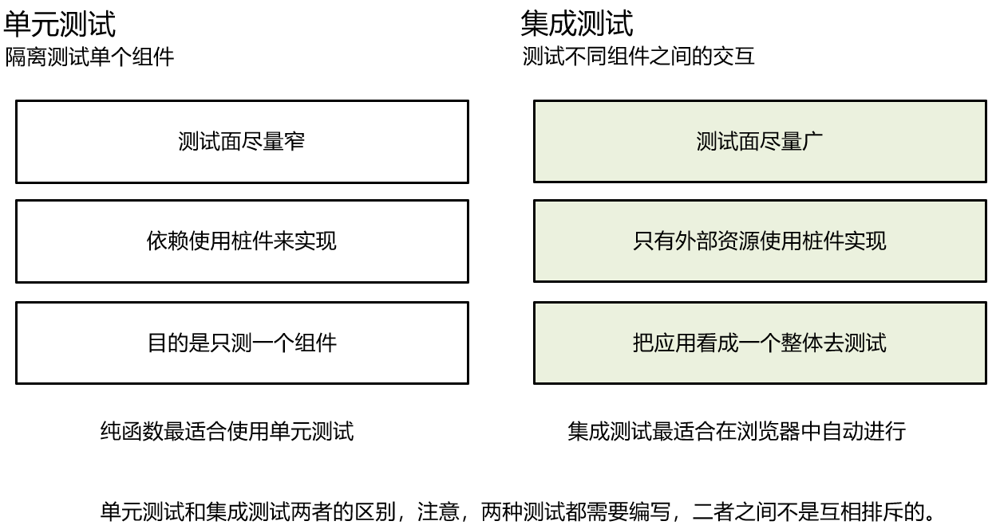

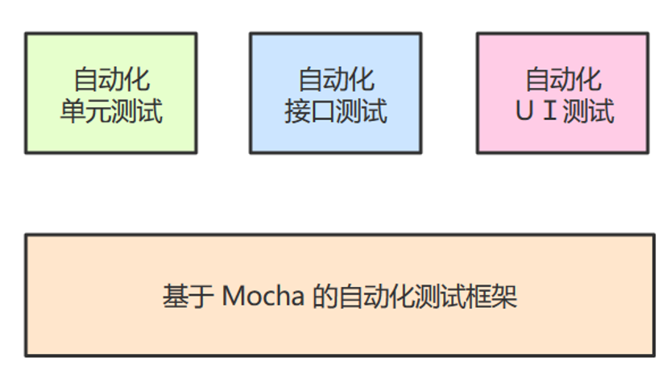

##### 5、代码覆盖率

- 行覆盖率（line coverage）：是否每一行都执行了？
- 函数覆盖率（function coverage）：是否每个函数都调用了？
- 分支覆盖率（branch coverage）：是否每个if代码块都执行了？
- 语句覆盖率（statement coverage）：是否每个语句都执行了？

##### 6、第三方库

- 自动化测试框架：mocha
- 断言库：chai
- 测试覆盖：Istanbul
- 测试辅助：sinon

##### 7、服务端单元测试

```bash
# 1. 编写被测模块sum.js 在sum.js中暴露出add方法 并且该方法在add.js中引入
~/grunt-demo(mocha-be) » cat sun.js

function add(x,y){
    return Number(x) + Number(y);
}

# 2. 对add.js编写测试脚本文件sum.test.js 
~/grunt-demo(mocha-be) » cat sum.test.js

var add = require('../sum');

var expect = require('chai').expect;

describe('加法函数的测试',function(){
  it('0 + 0 = 0',function(){
    expect(add(0,0)).to.be.equal(0);
  });
  it('1 + 0 = 1',function(){
    expect(add(1,0)).to.be.equal(1);
  });
  it('"1" + "0" = "1"',function(){
    expect(add('1','0')).to.be.equal(1);
  });
  it('20 + 5 = 25',function(){
    expect(add(20,5)).to.be.equal(25);
  })
});

~/grunt-demo(mocha-be) » cat Gruntfile.js
module.exports = function (grunt) {
  grunt.initConfig({
    mochacli: {
      options: {
        reporter: 'spec',
        bail: true
      },
      all: ['test/*.js']
    },
    mocha_istanbul: {
      coverage: {
        src: 'test'
      }
    },
    istanbul_check_coverage: {
      default: {
        options: {
          coverageFolder: 'coverage*',
          check: {
            lines: 90,
            statements: 90
          }
        }
      }
    }
  });

  grunt.loadNpmTasks('grunt-mocha-cli');
  grunt.loadNpmTasks('grunt-mocha-istanbul');

  grunt.registerTask('default', ['mochacli']);   
  grunt.registerTask('cover', ['mocha_istanbul']);
  grunt.registerTask('check-cover', ['istanbul_check_coverage']);
};

# 3. 安装插件，并且执行mocha命令查看单元测试结果
~/grunt-demo(mocha-be) » npm i -D grunt grunt-mocha mocha chai
------------------------------------------------------------
~/grunt-demo(mocha-be) » mocha
  加法函数的测试
    ✓ 0 + 0 = 0
    ✓ 1 + 0 = 1
    ✓ "1" + "0" = "1"
    ✓ 20 + 5 = 25
  4 passing (12ms)
  
# 4. 查看代码覆盖率
~/grunt-demo(mocha-be*) » node_modules/.bin/istanbul cover app.js 1 2
1 + 2 = 3
=============================================================================
Writing coverage object [/home/wangding/grunt-demo/coverage/coverage.json]
Writing coverage reports at [/home/wangding/grunt-demo/coverage]
=============================================================================

=============================== Coverage summary ===============================
Statements   : 100% ( 6/6 )
Branches     : 50% ( 2/4 )
Functions    : 100% ( 1/1 )
Lines        : 100% ( 6/6 )
```

##### 8、前端代码单元测试

```bash

```

##### 9、HTTP接口测试

##### 10、单元测试的三个核心技术点

- 隔离依赖
- 测试用例
- 设计可测代码

### 四、性能优化

##### 1、为什么需要性能优化？

##### 2、如何评价性能好坏？

##### 3、性能优化都有哪些手段

- 打包

  合并小的代码文件为一个大的代码文件，好处：减少http通信

- 提高首页的加载速度（延迟加载，只加载首页的组件）

  极端（不打包）10 js

  中庸（分别打包：打两个包，1.首页加载需要的js包；2.延迟加载的js包）

  极端（打包）1 减少

##### 4、什么时候做性能优化？

##### 5、web应用的安装过程

- 下载资源

  下载HTML 网页文件、CSS 文件、JavaScript 文件、图片、图标、字体，等多媒体文件，用HTTP 协议的 GET 请求

- 构建DOM

- CSS渲染

- 执行JS

##### 6、压缩HTML

目的和意义

```bash
# 1. 创建分支并且拷贝文件
# 2. 安装插件
~/grunt-demo(htmlmin) » npm i -D grunt grunt-contrib-htmlmin
------------------------------------------------------------
# 3. 编写Gruntfile.js文件 进行压缩
module.exports = function(grunt){
  grunt.initConfig({
    htmlmin:{
      options:{
        collapseWhitespace: true,
        preserveLineBreaks: false
      },
      dev: {
        files: {
          'dist/index.html': './index.html'
        }
      }
    }
  });

  grunt.loadNpmTasks('grunt-contrib-htmlmin');

  grunt.registerTask('default',['htmlmin']);
};
------------------------------------------------------------
# 4. 执行grunt
~/grunt-demo(htmlmin) » grunt
Running "htmlmin:dev" (htmlmin) task
Minified 1 files
Done.
------------------------------------------------------------
~/grunt-demo(htmlmin) » ll index.html dist/index.html
-rw-rw-r--. 1 wangding wangding 719 3月  13 17:00 dist/index.html
-rw-rw-r--. 1 wangding wangding 786 3月  13 16:57 index.html
```

##### 7、压缩CSS

grunt-contrib-cssmin

##### 8、压缩JavaScript

grunt-contrib-uglify

##### 9、压缩图片

```bash
# 1. 创建分支并且拷贝文件
# 2. 安装插件
~/grunt-demo(imgmin) » npm i -D grunt grunt-contrib-imagemin
------------------------------------------------------------
# 3. 按照上面的命令，将图片放到images文件夹下，编写Gruntfile.js文件 进行压缩
module.exports = function(grunt){
  grunt.initConfig({
    imagemin:{
      dynamic: {
        files: [{
          expand: true,
          cwd: '.../images',
          src: ['**/*.{png,jpg,gif}'],
          dest: 'dist/'
        }]
      }
    }
  });

  grunt.loadNpmTasks('grunt-contrib-imagemin');

  grunt.registerTask('default',['imagemin']);
};
------------------------------------------------------------
# 4. 执行grunt
~/grunt-demo(imgmin) » grunt
Running "imagemin:dynamic" (imagemin) task
Minified 8 images (saved 87.2 kB - 28.6%)

Done.
------------------------------------------------------------
~/grunt-demo(imgmin) » ll images/ dist
```

​			image format

- bmp 互联网不用
- jpg 会压缩，但会失真
- gif 256色，动图
- png 透明
- webp Google新格式，透明，压缩的体积更小
- svg 矢量图，不是存的像素，就是本本文件

##### 10、打包合并

```bash
# 1. 创建分支并且拷贝文件
# 2. 安装插件
~/grunt-demo(concat) » npm i -D grunt grunt-contrib-concat 
------------------------------------------------------------
# 3. 编写Gruntfile.js文件 进行压缩
module.exports = function(grunt){
  grunt.initConfig({
    concat:{
      options: {
        separator: ';' # 文件之间用分号分隔
      },
      dist: {
        src: ['rectangle.js', 'calc.js'],
        dest: 'dist/bundle.js',
      }
    }
  });

  grunt.loadNpmTasks('grunt-contrib-concat');

  grunt.registerTask('default',['concat']);
};
------------------------------------------------------------
# 4. 执行grunt
~/grunt-demo(concat) » grunt
Running "concat:dist" (concat) task

Done.
------------------------------------------------------------
~/grunt-demo(concat) » cat dist/bundle.js
```

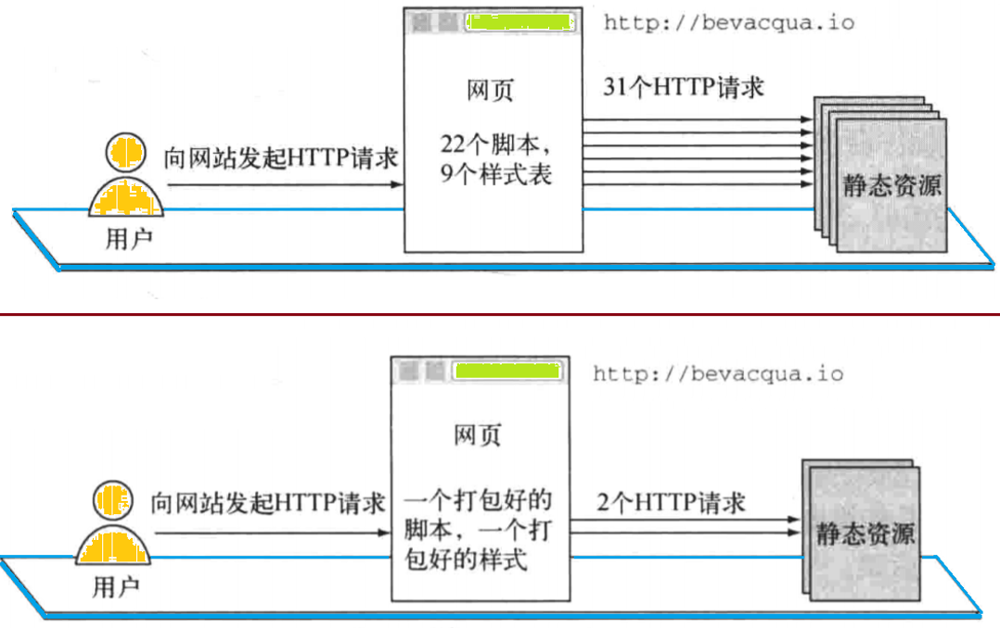

11、合并子图

```bash
# 1. 创建分支并且拷贝文件
# 2. 安装插件
~/grunt-demo(sprite) » npm i -D grunt grunt-spritesmith 
------------------------------------------------------------
# 3. 按照上面的命令，将图片放到images文件夹下,编写Gruntfile.js文件 进行压缩
module.exports = function(grunt){
  grunt.initConfig({
    sprite:{
      all: {
        src: '.../images/*.png',
        dest: '.../images/all.png',
        destCss: './sprites.css'
      }
    }
  });

  grunt.loadNpmTasks('grunt-spritesmith');

  grunt.registerTask('default',['sprite']);
};
------------------------------------------------------------
# 4. 执行grunt
~/grunt-demo(sprite) » grunt
Running "sprite:all" (sprite) task
Files "./sprites.css", ".../images/all.png" created.

Done.
------------------------------------------------------------
~/grunt-demo(sprite*) » cat sprites.css
------------------------------------------------------------
.icon-fork {
  background-image: url(images/all.png);
  background-position: -64px 0px;
  width: 32px;
  height: 32px;
}
.icon-github {
  background-image: url(images/all.png);
  background-position: -64px -32px;
  width: 32px;
  height: 32px;
}
.icon-twitter {
  background-image: url(images/all.png);
  background-position: 0px -64px;
  width: 32px;
  height: 32px;
}
```

## UI概述

##### 1、interface接口

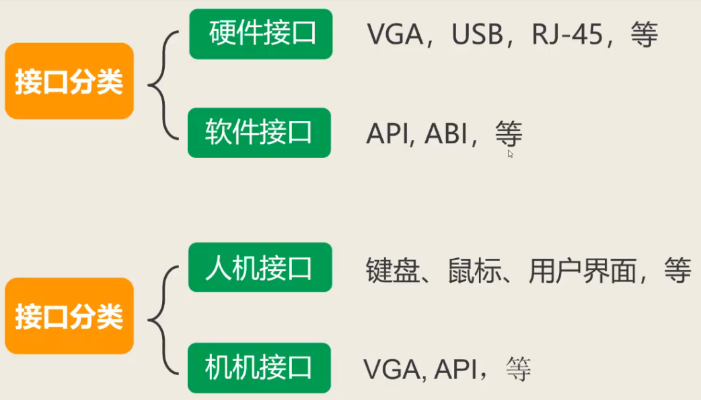

##### 2、UI类型

- Batch Interface
- TUI —— Text-based User Interface
- CLI —— Command-line user Interface
- GUI —— WUI + MUI
- WUI
- TUI

cli——命令行界面

命令 + [参数] + [选项]

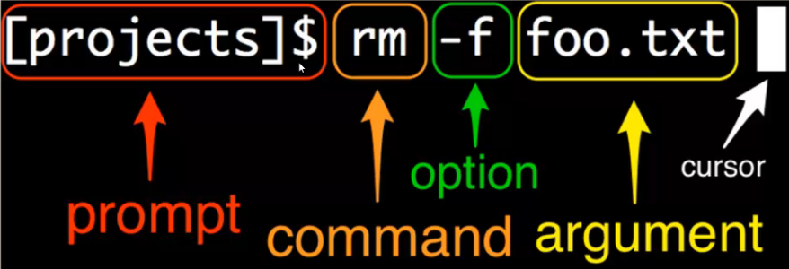

gui——图形用户界面

gui分为wui（web user interface）和mui（mobile user interface）

window，page

sdi，mdi

##### 3、CLI交互要素

- 命令行语法
- 管道和重定向
- 字符展开
- 命令类型
- 命令行提示符

##### 4、GUI交互要素

GUI，图形用户界面，主要就是窗体界面。

控件是最小的要素

1. 窗体

   按处理文档数量分类：

   - SDI
   - MDI

   按窗体形状分类：

   - 规则窗体
   - 不规则窗体

   主窗体自上而下包含的元素：

   - 标题栏 titlebar
     - App Logo
     - App Name
     - Doc Name
     - titlebar Button
   - 菜单栏 menu bar
   - 工具栏 tool bar
   - 内容区 window content
   - 状态栏 status bar

2. 对话框

   dialog box

   组成

   - 标题栏
   - 主内容区域（各种控件）
   - 操作按钮

   分两大类：

   - 模态对话框 modal：对话框弹出情况下，不可操作主窗体内容
   - 非模态对话框 modeless：对话框弹出情况下，可操作主窗体内容

   特殊的对话框：向导

   注意对话框标题栏跟窗体标题栏的区别

   常见对话框：

   - about box
   - alert box

3. 标题栏

   title bar（app icon，app name，doc name，system button ）

4. 菜单栏

   menu bar（function入口）（对function分类），菜单的类型

   - 下拉菜单 pull down menu
   - 系统菜单 system menu
   - 快捷菜单 context menu （上下文菜单）

5. 工具栏

6. 内容栏

7. 状态栏

8. 控件

##### 5、GUI视觉要素

- 字体
- 颜色
- 图像
- 图形
- 图标

##### 6、UI设计原则

- 亲密

  将彼此相关联的想，在空间的角度上更靠近写

  高内聚低耦合

  重要度：从左到右，从上到下，重要的放在左上角

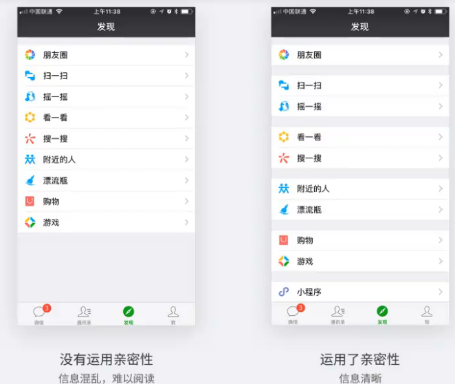

- 对齐

  使页面统一且有条理

  物理对齐和视觉对齐

- 重复

  保持一致，避免过多的重复一个元素

- 对比

  重要的东西强调出来

##### 7、WUI

- WUI 和 GUI 的差异
  - 开发方式
  - 交互要素

以百度脑图 web app 作为研究对象

- 交互要素，逐一检查
- 视觉要素，逐一检查

## H5内置控件

##### 1、概述

控件是最小的要素

控件：属性（控件的内容和外观）、方法、事件（）

html：内容和结构div>(label+input+br)*5

css：样式

js：交互

倒计时按钮

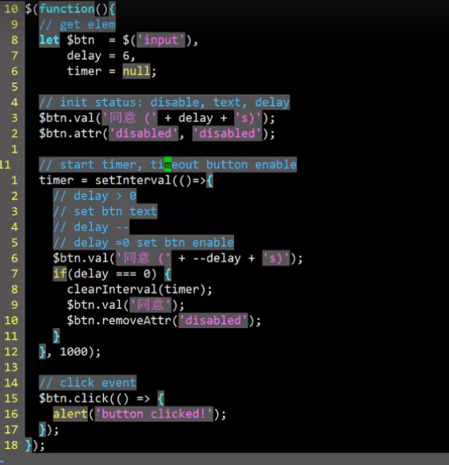

##### 2、控件分类

1. 文本框

   ```html
   <input type="text">
   <textarea>
   ```

2. 按钮类

   ```html
   <input type="button" value=“按钮”>
   <button>按钮</button>
   ```

3. 弹框类

   alert、prompt、confirm

4. 列表列

   ```html
   <select>
   <option value="volvo">Volvo</option>
   <option value="saab">Saab</option>
   <option value="opel">Opel</option>
   <option value="audi">Audi</option>
   </select> 
   ```

5. 时间日期类

   ```HTML
   <input id="time" type="time">
   <input id="month" type="month">
   ```

6. 其他（标签、滑杆、进度条、颜色框、表单容器、文件上传

   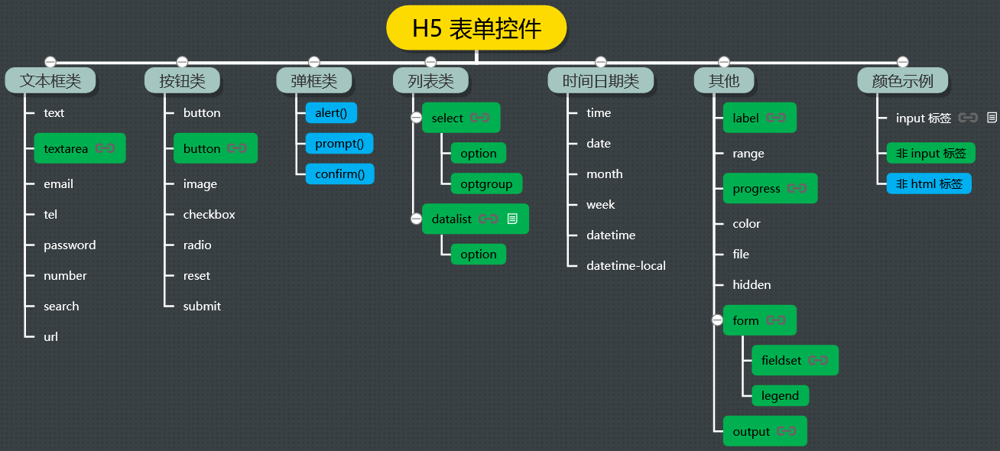

##### 3、控件三要素

- 属性
- 方法
- 事件

##### 4、UI代码风格

分类一

- JQuery代码风格
- 原生API代码风格

分类二

- 代码分离

- 代码不分离

HTML、CSS 和 JavaScript 代码分离的意义HTML、CSS 和 JavaScript 代码分离的意义：全写在一个HTML里会造成：**不能代码自动补全**，不知道补啥代码；**不能代码静态检查**，不知道查啥语法；**不能单元测试**，没有模块化，分开写，就是职责单一

## 数据合法性校验

##### 1、什么是数据合法性校验

##### 2、校验内容

- 是否为空值（必填字段）

- 数据类型（int，String）

- 取值范围（对于数据比如<0，对于字符串比如最短为6位）

- 数据模式（e-mail）

##### 3、校验流程

- 用户输入数据

- 数据合法性校验（if判断）

- 校验结果处理

  注意：在每个校验需要提示不同的信息，比如提示email字段不能为空、密码长度不足8位，要让用户得知是哪校验不匹配

##### 4、校验意义

- 得到正确的数据

- 保护用户

- 保护自己

##### 5、校验方案

按校验执行的位置分类：

- 客户端校验
- 服务器端校验

按校验的颗粒度分类：

- **表单级校验**（比如点击计算的时候，对高度宽度都校验）c1

  submit事件、click事件

- **字段级校验**（表单字段，一个email，键值对）c2 = c1 + c12

  事件：focusOut、blur

  校验：if判断

  注意：多字段是，利用冒泡机制

  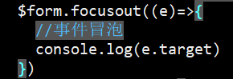

  注意：集中校验是必须的，虽然实现了字段校验，也需要集中校验

  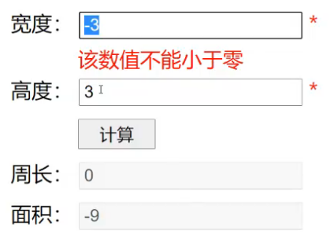

- **字符级校验** c3 = c1 + c12 + c13

  事件：keyPress，keyDown，keyUp

  校验：if判断

  获取用户的按键信息 e.key e.target e.target.value

  例如文本框里有ab，正在按c

  e.key=c， e.target=$width，e.target.value=ab

  注意：合法字符（0-9.-eE）和非法字符（a-zA-Z/*-+）

  过滤非法字符：e.preventDefault()

  合法字符也有规则

  代码量：c1<c2<c3

 按校验代码的编写人分类：

- 自己验证

- H5 验证（标签type=email，tel）

  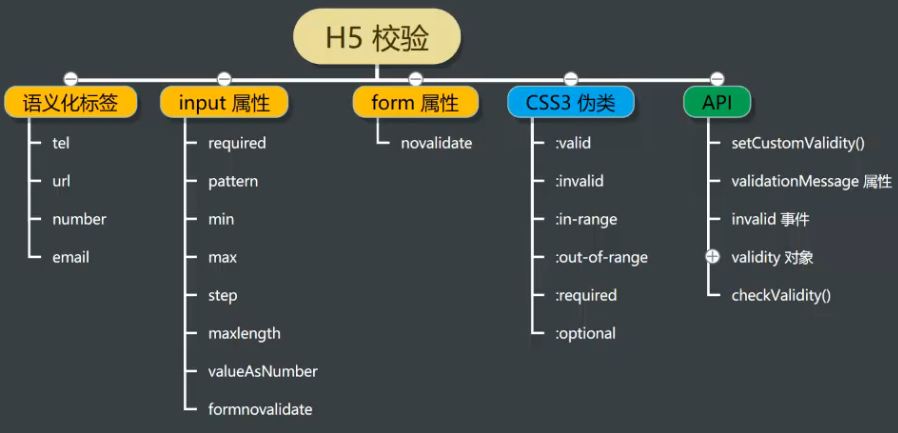

  1. 语义化标签
  2. input属性
  3. form属性
  4. css3伪类
  5. api

- 混合验证

##### 6、表单级校验

```js
/*
    说明：表单级验证只需要在用户点击计算按钮的时候进行空值 字符串 数据取值范围的验证即可，同时需要给表单添加两个div块
*/
# rectangle.js
/* global rectangle: true */
$(function(){
  var $width = $('#width'),
      $height = $('#height'),
      $btnCal = $('#calculate'),
      $perimeter = $('#perimeter'),
      $area = $('#area'),
      $widthValidation = $('#width-validation'),
      $heightValidation = $('#height-validation');

  $btnCal.click(function(){

    var w = $width.val(),
        h = $height.val();

    var widthResult = valid(w);
    var heightResult = valid(h);

    if(!widthResult.isOk){
      $widthValidation.html('宽度' + widthResult.reason);
      $width.select();
      return;
    }

    if(!heightResult.isOk){
      $heightValidation.html('高度' + heightResult.reason);
      $height.select();
      return;
    }

    $widthValidation.html('');
    $heightValidation.html('');

    var rect = rectangle();
    $perimeter.val(rect.perimeter(w,h));
    $area.val(rect.area(w,h));
  });

  $btnCal.mousedown(function(e){// 当点击事件和失去焦点事件冲突的时候触发
    e.preventDefault();
  });
});

# calc.js
function valid(data){
  var result = {
    isOk:false,
    reason:''
  };

  if(data === ''){
    result.reason = '不能为空';
    return result;
  }

  if(Number(data) < 0){
    result.reason = '不能为负数';
    return result;
  }

  if(!/^-?(0|[1-9]\d*)(\.\d*)?([eE][+-]?\d+)?$/.test(data)){
    result.reason = '不是合法数字';
    return result;
  }

  result.isOk = true;
  return result;
}
```

##### 7、字段级校验

```js
/*
    需要在宽度和高度失去焦点的时候添加数据校验事件
*/
# rectangle.js
/* global rectangle: true */
$(function(){
  var $width = $('#width'),
      $height = $('#height'),
      $btnCal = $('#calculate'),
      $perimeter = $('#perimeter'),
      $area = $('#area'),
      $widthValidation = $('#width-validation'),
      $heightValidation = $('#height-validation');

  $width.focusout(function(){
    var w = $width.val();

    var result = valid(w);
    if(!result.isOk){
      $widthValidation.html('宽度' + result.reason);
      $width.select();
      return;
    }
    $widthValidation.html('');
  });

  $height.focusout(function(){
    var h = $height.val();

    var result = valid(h);
    if(!result.isOk){
      $heightValidation.html('高度' + result.reason);
      $height.select();
      return;
    } 
    $heightValidation.html('');
  });
  $btnCal.click(function(){

    var w = $width.val(),
        h = $height.val();

    var widthResult = valid(w);
    var heightResult = valid(h);

    if(!widthResult.isOk){
      $widthValidation.html('宽度' + widthResult.reason);
      $width.select();
      return;
    }

    if(!heightResult.isOk){
      $heightValidation.html('高度' + heightResult.reason);
      $height.select();
      return;
    }

    $widthValidation.html('');
    $heightValidation.html('');

    var rect = rectangle();
    $perimeter.val(rect.perimeter(w,h));
    $area.val(rect.area(w,h));
  });

  $btnCal.mousedown(function(e){// 当点击事件和失去焦点事件冲突的时候触发
    e.preventDefault();
  });
});
```

##### 8、字符级校验

```js
/*
    说明：需要给字符添加keypress事件 并检验输入的字符的内容是否合法
*/
# rectangle.js
/* global rectangle: true */
$(function(){
  var $width = $('#width'),
      $height = $('#height'),
      $btnCal = $('#calculate'),
      $perimeter = $('#perimeter'),
      $area = $('#area'),
      $widthValidation = $('#width-validation'),
      $heightValidation = $('#height-validation');

  $width.keypress(function(e){
    if(!isLegalKey(e.key,e.target.value,e.target.selectionStart)){
      e.preventDefault();
    }
  });

  $width.focusout(function(){
    var w = $width.val();

    var result = valid(w);
    if(!result.isOk){
      $widthValidation.html('宽度' + result.reason);
      $width.select();
      return;
    }
    $widthValidation.html('');
  });

  $height.keypress(function(e){
    if(!isLegalKey(e.key,e.target.value,e.target.selectionStart)){
      e.preventDefault();
    }
  });

  $height.focusout(function(){
    var h = $height.val();

    var result = valid(h);
    if(!result.isOk){
      $heightValidation.html('高度' + result.reason);
      $height.select();
      return;
    } 
    $heightValidation.html('');
  });

  $btnCal.click(function(){

    var w = $width.val(),
        h = $height.val();

    var widthResult = valid(w);
    var heightResult = valid(h);

    if(!widthResult.isOk){
      $widthValidation.html('宽度' + widthResult.reason);
      $width.select();
      return;
    }

    if(!heightResult.isOk){
      $heightValidation.html('高度' + heightResult.reason);
      $height.select();
      return;
    }

    $widthValidation.html('');
    $heightValidation.html('');

    var rect = rectangle();
    $perimeter.val(rect.perimeter(w,h));
    $area.val(rect.area(w,h));
  });

  $btnCal.mousedown(function(e){// 当点击事件和失去焦点事件冲突的时候触发
    e.preventDefault();
  });
});

# calc.js
function isLegalKey(key,content,pos){
  if(/[abcdf-zABCDF-Z`~!@#$%^&*()\-=_+[\]{}|;:'",<>/?\\]/.test(key)){
    return false;
  }

  if(key === '.'){
    if(pos === 0 || content.indexOf('.') !== -1) return false;
    if(pos === 1 && content.substring(0,1) === '-') return false;
  }

  if(key === 'e'){
    if(pos === 0 || content.indexOf('e')!== -1 
         || content.indexOf('E')!==-1) return false;
    if(pos === 1 && content.substring(0,1) === '-') return false;
  }

  if(key === 'E'){
    if(pos === 0 || content.indexOf('e')!== -1 
         || content.indexOf('E')!==-1) return false;
    if(pos === 1 && content.substring(0,1) === '-') return false;
  }
  return true;
}
```

9、H5校验

```js
/*
    说明：H5校验是通过H5的内置控件提供的数据合法性校验，需要改变html和css文件，针对js文件不许进行大部分改变
*/
# rectangle.js
$(function(){
  var $width = $('#width'),
      $height = $('#height'),
      $form = $('form'),
      $perimeter = $('#perimeter'),
      $area = $('#area'),
      $widthValidation = $('#width-validation'),
      $heightValidation = $('#height-validation');

  $form.submit(function(e){
    var w = $width.val(),
        h = $height.val();

    var rect = rectangle();
    $perimeter.val(rect.perimeter(w,h));
    $area.val(rect.area(w,h));
    e.preventDefault();
  });
});
```

```html
<!DOCTYPE html>
<html lang="en">
<head>
  <meta charset="UTF-8">
  <title>矩形计算器</title>
  <link rel="stylesheet" href="rectangle.css">
</head>
<body>
  <div>
    <form>
      <label for="width">宽度：</label>
      <input type="number" id="width" required min="0" step="0.01"><span></span><br/>
      <label for="height">高度：</label>
      <input type="number" id="height" required min="0" step="0.01"><span></span><br/>
      <label for=""></label>
      <input type="submit" id="calculate" value="计算">
      <br/>
      <label for="perimeter">周长：</label>
      <input type="text" id="perimeter" disabled>
      <br/>
      <label for="area">面积：</label>
      <input type="text" id="area" disabled> 
      <br/>
    </form>
  </div>
  <script src="//apps.bdimg.com/libs/jquery/2.1.4/jquery.min.js"></script>
  <!-- build:js bundle.min.js -->
  <script src="calc.js"></script>
  <script src="rectangle.js"></script>
  <!-- endbuild -->
</body>
</html>
```

```css
input:invalid+span:after{
  content:'✖';
  color:red;
}
input:valid+span:after{
  content: '✓';
  color: green;
}
```

## 第三方组件

##### 1、第三方组件库

组件——组（组合） 件（控件）

- JQuery UI
- jQuery Mobile UI
- jQuery EasyUI
- LayUI
- WeUI
- YUI

##### 2、常用的第三方组件

- 图表组件

  使用 EChart 组件绘制二进熵函数曲线

- 地图组件

- 语法高亮

  使用 behave 插件让 textarea 文本框具有 IDE 的代码编辑功能

- 集成开发环境

- 表格组件

  使用 handsontable 插件在页面上显示一个 Excel 表格

- 公式组件

  使用 Mathquill 插件在页面上实现一个数学公式编辑功能

- 整页轮播组件

##### 3、为什么使用第三方组件而不使用h5内置控件？

- h5控件不全
- h5控件在不同浏览器上表现（外观）不一致，h5标准
- 第三方组件库控件自行开发，具有统一的样式

## 自定义ui组件

##### 1、组件化的思路

ui组件化体现的思想本质：分治法

##### 2、代码维护原则：

- 就近原则

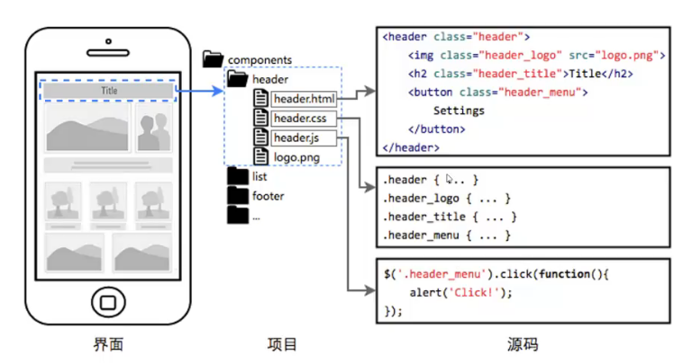

- 模块划分

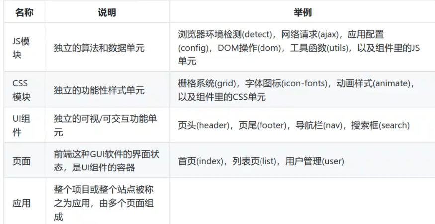

##### 3、组件化的优势

- 便于重用，提高开发效率
- 利于并行开发，提高开发效率
- 降低问题的规模和复杂度
- 便于代码维护，形成隔离带

##### 4、组件分类

按组件是否需要指定容器分类

- 指定容器组件
- 不指定容器组件

按组件的生命周期分类

- 长期组件
- 临时组件

按组件是否绘制 DOM 分类

- 自绘制DOM组件
- 不绘制DOM组件

安装组件是否依赖其他库分类

- 独立组件

- 非独立组件

##### 5、UI组件的面向对象封装（三种方式）

1. {}object
    let $timerBtn = {
       show:function(){}
    }

2. 工厂函数（匿名函数的立即执行表达式+闭包）->全局对象
    封装：
    let $timerBtn = (function(){
     //...
     //
     function show(){

     }

     function destroy(){

     }  return {
       show, destroy
     }
    })();

    使用：
    $timerBtn.show()

3. 构造函数
    封装：
    function TimerBtn(){
     this.show = function(){

     }
    }

   使用：
   let btn = new TimerBtn()
   btn.show();

##### 6、示例

- 工厂函数

  
  ```javascript
  let $timerBtn = (function(){
    let $btn 	= $('<input type="button" class="timer-button">'),
      	cfg = {
              container:'body',
              title:    '同意',
              delay:    6,
              enable:   false,
              onClick:  null
          },   
       	timer = null;
      $btn.css({
          height:'50px',
          width:'150px',
          'font-size':'1.2em'
      }
  )
  
    //
    function show(config){
      $.extend(cfg,config)
      $(cfg.container).append($btn);
      
      $btn.val(cfg.title + '(' + cfg.delay +'s)')
      $btn.attr('disabled','disabled');
  
      timer = setInterval(()=>{
        $btn.val(cfg.title + '(' + --cfg.delay + 's)');
        if(cfg.delay == 0){
          clearInterval(timer);
          $btn.val(cfg.title);
          $btn.removeAttr('disabled')
        }
      },1000)
  
      //event bind
      $btn.click(cfg.onClick)
        }
  
        function destroy(){
          $btn.remove()
        }
  
        return {
          show, destroy
        }
    })();
  ```


- 构造函数

  ```javascript
   function TimerBtn(){
    	let $btn = $('<input type="button" class="timer-button">'),
           cfg = {
              container:'body',
              title:    '同意',
              delay:    6,
              enable:   false,
              onClick:  null
          },   
           timer = null;
       $btn.css({
         height:'50px',
         width:'150px',
         'font-size':'1.2em'
       })
  
  
       this.show(config){
           $.extend(cfg,config)
           $(cfg.container).append($btn);
           $btn.val(cfg.title + '(' + cfg.delay +'s)')
           $btn.attr('disabled','disabled');
  
           timer = setInterval(()=>{
               $btn.val(cfg.title + '(' + --cfg.delay + 's)');
               if(cfg.delay == 0){
                   clearInterval(timer);
                   $btn.val(cfg.title);
                   $btn.removeAttr('disabled')
               }
           },1000)
  
           //event bind
           $btn.click(cfg.onClick)
       }
  
       this.destroy(){
           $btn.remove()
       }
  
       return {
           show, destroy
       }
   })
  ```

  ```html
  <!DOCTYPE html>
  <html lang="en">
  <head>
      <meta charset="UTF-8">
      <title>定时器按钮</title>
      <link rel="stylesheet" href="./timer-button.css">
  </head>
  <body>
      <input type="button" id="add" value="添加定时器按钮"/>
      <input type="button" id="del" value="删除定时器按钮"/><hr>
  
      <div id="test">
  
      </div>
  <script src="//apps.bdimg.com/libs/jquery/2.1.4/jquery.min.js"></script>
  <script src="./timer-button.js"></script>
      <script>
          $(
              ()=>{
                  let $btnAdd = $('#add'),
                      $btnDel = $('#del');
                  $btnAdd.click(()=>{
                      //构造函数方式
                      let timerB = new timerBtn();
                      timerB.show({
                          container:"#test",
                          title:"发送验证码",
                          onClick:()=>{console.log('button click')}
                      })
  
                      //工厂函数方式
                      /*
                     $timerBtn.show({
                        container:"#test",
                        title:"发送验证码",
                        onClick:()=>{console.log('button click')}
                      })
                    */  
                  })
                  $btnDel.click(()=>{
                      $timerBtn.destroy()
                  })
              }
          )
      </script>
  </body>
  </html>
  ```
  

##### 7、组件化技术细节

组件封装

- JavaScript 代码封装
- CSS 代码封装

组件绘制

- 模板字符串生成
- 操作 DOM 节点生成

组件样式

- 外部样式表，可以人为修改样式表
- 动态设置样式，可以把样式参数化

组件参数化

组件的输入/输出

- 输入
  - 初始化
    - 父容器
    - 参数
    - 样式
  - 用户输入
- 输出
  - 事件机制
  - 回调函数，初始化注入
  - 数据绑定

组件事件绑定

组件实例化

组件生命周期

- 生命期各阶段：
  - 创建
  - 活动
  - 销毁
- 组件寿命：
  - 永久的，与应用生命期等长
  - 临时的，短与应用生命期

css模块化

require.js

- 为什么要有require.js？
  1. 模块化<script></script>模块划分，模块之间的依赖关系
  2. 延迟加载

## SPA&MVC

##### 1、多页

多页跳转

多页嵌套

多页之间数据共享方式？

- 扩文档通信
- 客户端存储技术
  - cookie
  - local storage
  - 等

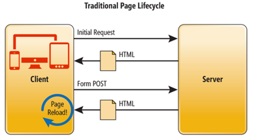

##### 2、单页

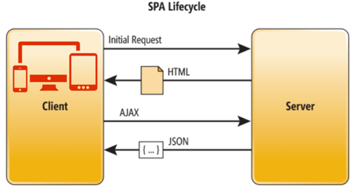

##### 3、前后端分离

- 前后端分离的单页或多页
- 后台渲染的多页

##### 4、前端路由

##### 5、MVC

MVC——Model View Controller

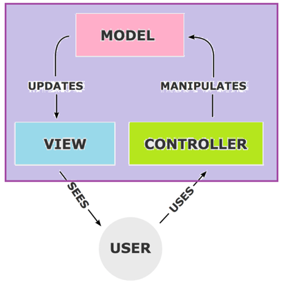

##### 6、MVP

Model-View-Presenter 与传统的MVC模式类似，但有一些关键区别：

View没有直接引用Model

Presenter 具有对视图的引用，并根据对模型的更改对其进行更新

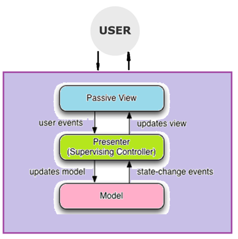

##### 7、如何实现MVC

## 数据存储

##### 1、解决问题

- 状态保持
- 数据持久化

##### 2、存储分类

- 服务器端存储
- 客户端存储

3、客户端存储方式

- cookies
- local storage
- session storage
- application cache
- indexDB
- web sql

4、服务端存储方式

- cache
- 内存
- 磁盘文件
- 数据库